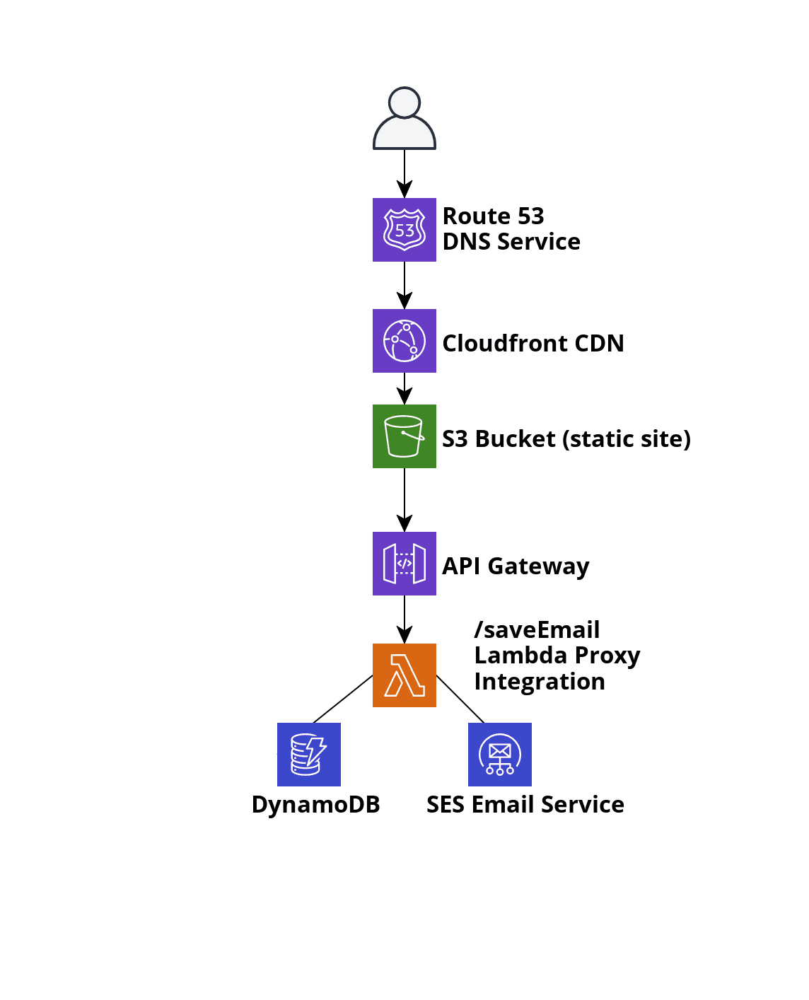

# nicholasklaene.com

Personal website built to serve as a central hub for my professional social media accounts & projects.

## Technologies Used

Frontend: Vue.js, SCSS

Backend: Python 

Deployment/Cloud: AWS Serverless with Lambda, API Gateway, DynamoDB, S3, Cloudfront, Route 53, SES

## Architecture: 

  

